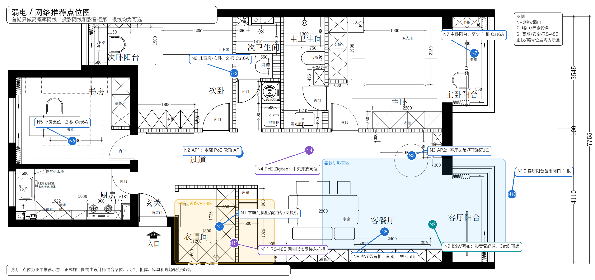
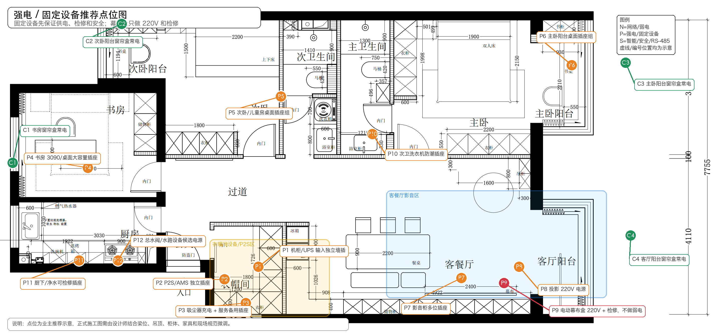
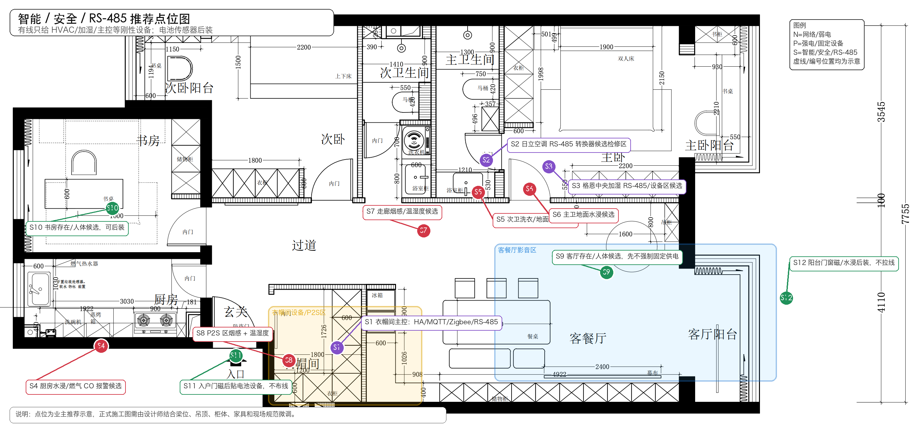

# 明日设计师点位图套件（2026-07-05）

**用途：** 这是基于设计师新版平面图 `references/newFloorPlan.png` 绘制的业主侧推荐点位图。
**定位：** 供明天和设计师沟通使用，不替代正式水电施工图。正式图纸仍需设计师结合梁位、吊顶、柜体、家具、设备尺寸、物业要求和现场规范落图。

## 1. 本轮设计原则

1. 成本优先，只做本轮明确需要、入住后高概率使用、封墙后难补的点位。
2. 弱电星形回衣帽间机柜，不串接，不暗接。
3. AP、PoE Zigbee、RS-485、机柜、窗帘电机、P2S、书房/桌面网口属于重点。
4. 电动幕布盒不直接接入智能系统，只预留 220V 电源、原厂控制/遥控接收空间和检修条件。
5. 投影位 Cat6 只是低成本可选备用；影音柜首期 1 根 Cat6，第二根只在同点位施工成本很低时可选。
6. 入户高位摄像头、低位门铃、P2S 墙面网口、AP-R/AP3 本轮不预留。
7. Zigbee 电池传感器、水浸、门磁/窗磁、温湿度、CO2 等大多可以后装，不要求施工队逐点拉线。

## 2. 点位图

### 2.1 弱电 / 网络推荐点位图

| 编号 | 点位 | 施工口径 |
|---|---|---|
| N1 | 衣帽间机柜 / 配线架 / 交换机 | 全屋弱电汇聚点，落地 12U 机柜优先 |
| N2 | AP1 | 左侧走廊 PoE 吸顶 AP，服务书房、次卧、厨房、衣帽间一侧 |
| N3 | AP2 | 客厅边吊或可暗线顶面，允许偏置安装 |
| N4 | PoE Zigbee 协调器 | 中央开放高位，1 根 Cat6/Cat6A，PoE，不能放金属机柜内 |
| N5 | 书房桌位 | 2 根 Cat6A，服务 RTX 3090 工作站和备用 |
| N6 | 儿童房/次卧桌位 | 2 根 Cat6A，服务未来台式机和备用 |
| N7 | 主卧阳台桌位 | 至少 1 根 Cat6A，第二根按家具方案和成本决定 |
| N8 | 客厅影音柜 | 首期 1 根 Cat6；第二根仅同点位低成本时可选 |
| N9 | 投影/幕布协同点 | 影音穿线管必做；投影 Cat6 不作为必需项 |
| N10 | 客厅阳台 | 1 根备用网口 |
| N11 | RS-485 网关以太网 | RS-485 网关放衣帽间，网关以太网接入机柜交换机 |

### 2.2 强电 / 固定设备推荐点位图

| 编号 | 点位 | 施工口径 |
|---|---|---|
| P1 | 机柜/UPS 输入 | 衣帽间独立带地墙插，UPS 后接机柜 PDU |
| P2 | P2S/AMS | 独立插座，不接机柜 UPS/PDU |
| P3 | 吸尘器充电 / 服务备用 | 与机柜、P2S 插座分开 |
| P4 | 书房桌面电源 | 按 3090 工作站、多显示器和桌面设备考虑 |
| P5 | 儿童房/次卧桌面电源 | 按未来电脑、台灯、充电器考虑 |
| P6 | 主卧阳台桌面电源 | 若作为阅读/电脑桌，需避免窗帘和柜体遮挡 |
| P7 | 客厅影音柜 | 多位插座，考虑散热和检修 |
| P8 | 投影电源 | 220V，和吊架/影音管/幕布位置同图复核 |
| P9 | 电动幕布盒 | 220V + 检修；不做网线、RS-485 或控制线 |
| P10 | 次卫洗衣机 | 防潮、接地、漏保、排水、地漏一起复核 |
| P11 | 厨下/净水 | 可检修插座，不得被橱柜永久封死 |
| P12 | 总水阀/水路设备候选 | 若未来安装电动阀，需要电源、检修和手动操作空间 |
| C1-C4 | 各窗帘盒 | 单层窗帘，每组 1 台电机，电机侧 220V 常电和检修 |

### 2.3 智能 / 安全 / RS-485 推荐点位图

| 编号 | 点位 | 施工口径 |
|---|---|---|
| S1 | 衣帽间主控 | Mac mini / Home Assistant / MQTT / Zigbee / RS-485 网关汇聚 |
| S2 | 日立空调 RS-485 | 独立弱电管和厂家确认屏蔽线，回衣帽间 RS-485 网关 |
| S3 | 格恩中央加湿 RS-485 | 独立弱电管和厂家确认屏蔽线，不与日立共线共管 |
| S4 | 厨房水浸 / 燃气 CO 报警候选 | 水浸可后装；燃气/CO 按燃气公司、物业和产品说明落位 |
| S5 | 次卫洗衣水浸候选 | 洗衣机附近低位可放电池水浸传感器 |
| S6 | 主卫水浸候选 | 低位可检修，避免长期积水误报位置 |
| S7 | 走廊烟感/温湿度候选 | 烟感独立报警优先，不依赖 Home Assistant |
| S8 | P2S 区烟感 + 温湿度 | 只需保留安装空间，传感器可后装 |
| S9 | 客厅存在/人体候选 | 首期不强制固定供电，可先用可后装方案试点 |
| S10 | 书房存在/人体候选 | 可后装，不要求施工队拉线 |
| S11 | 入户门磁 | 后贴电池设备，不布线，不做执行器 |
| S12 | 阳台门窗磁 / 水浸 | 后装，不拉线 |

## 3. 明天请设计师重点确认

1. 衣帽间机柜、P2S 台面、吸尘器充电和服务备用插座是否会互相遮挡。
2. AP1、AP2、PoE Zigbee 的顶面出线能否暗走、明装设备能否遮住出线孔。
3. 客厅影音柜、投影、幕布盒和影音穿线管是否和沙发、餐桌、长柜、空调出风口冲突。
4. 电动幕布盒只做电源和检修，不做智能弱电，设计师需要在强电图而不是弱电图里表达。
5. 书房、儿童房/次卧、主卧阳台桌面位置是否最终确定；网口和插座要按家具深化图复核高度。
6. 日立空调和格恩中央加湿的 RS-485 起点、检修口、管线路径和厂家责任边界。
7. 次卫洗衣、厨下净水、总水阀、卫生间水浸候选位置是否可检修。
8. 每组窗帘盒的电机侧、220V 常电、接地和检修方式。

## 4. 不让设计师误解的边界

- 这些图是推荐点位图，不是最终施工图。
- 幕布盒不是智能网关点位。
- 投影 Cat6 是可选，不是必须。
- 客厅影音柜不是默认 2 根网线。
- P2S 不做墙面网口。
- 入户高低位摄像头/门铃本轮不预留。
- 电池类 Zigbee 传感器不要求逐点拉线。
