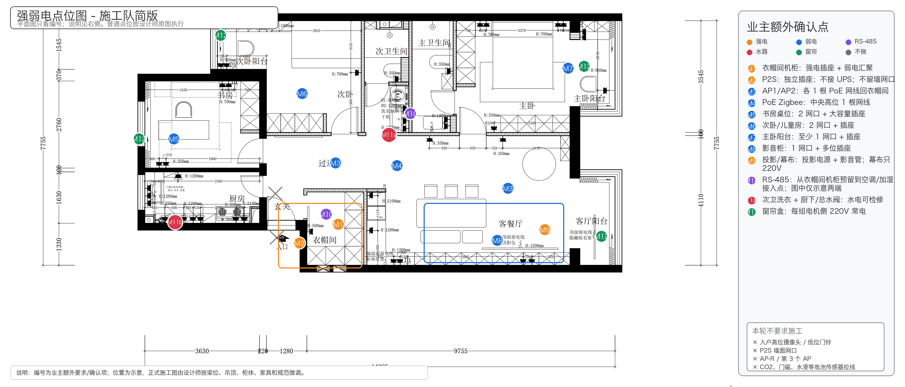
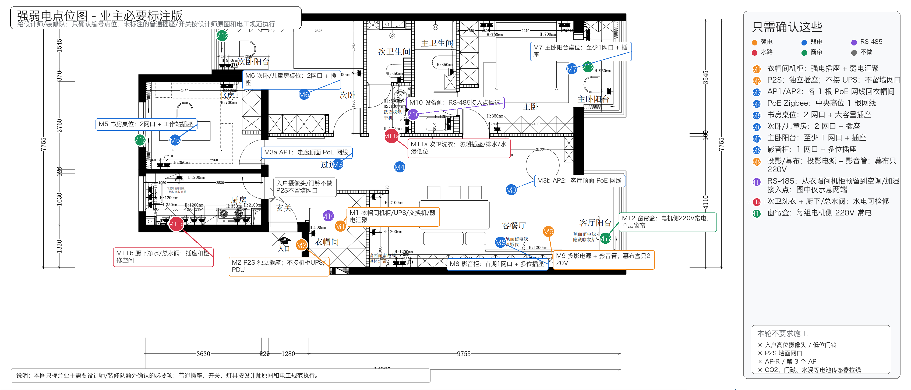

# 装修队强弱电必要确认（2026-07-07）

**用途：** 这是给设计师和装修队看的极简版强弱电确认材料。不要把长篇架构文档发给施工队；现场沟通优先使用下图。

## 1. 主推图片

## 2. 详细标注版

如设计师需要看箭头说明，可再发详细版：

## 3. 沟通口径

只请装修队/设计师确认 12 个编号点位：

1. M1 衣帽间机柜：强电插座 + 弱电汇聚。
2. M2 P2S：独立插座；不接 UPS；不留墙面网口。
3. M3 AP1/AP2：各 1 根 PoE 网线回衣帽间。
4. M4 PoE Zigbee：中央高位 1 根网线。
5. M5 书房桌位：2 网口 + 大容量插座。
6. M6 次卧/儿童房：2 网口 + 插座。
7. M7 主卧阳台：至少 1 网口 + 插座。
8. M8 影音柜：1 网口 + 多位插座。
9. M9 投影/幕布：投影电源 + 影音管；幕布只需要 220V。
10. M10 RS-485：从衣帽间机柜预留到空调/加湿接入点；图中仅示意两端，不代表实际斜穿走线路径。
11. M11a/M11b：次卫洗衣 + 厨下/总水阀，水电可检修。
12. M12 窗帘盒：每组电机侧 220V 常电。

本轮不要求施工：

- 入户高位摄像头 / 低位门铃；
- P2S 墙面网口；
- AP-R / 第 3 个 AP；
- CO2、门磁、水浸等电池传感器逐点拉线。

普通插座、开关、灯具仍按设计师原图和电工规范执行。
